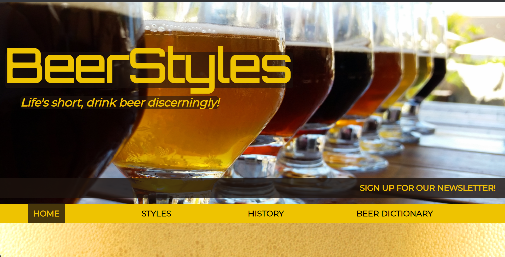
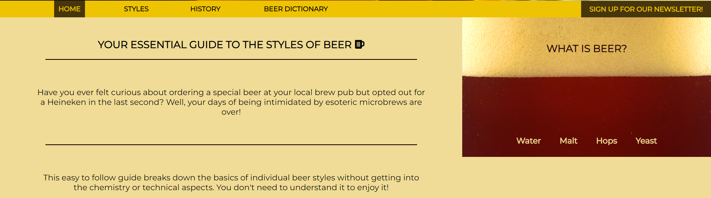
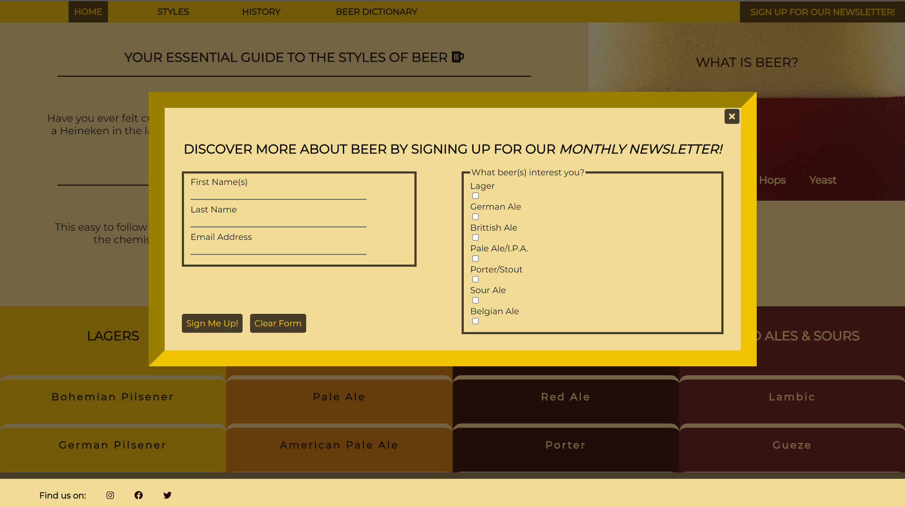
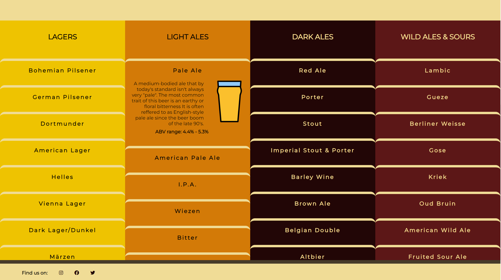
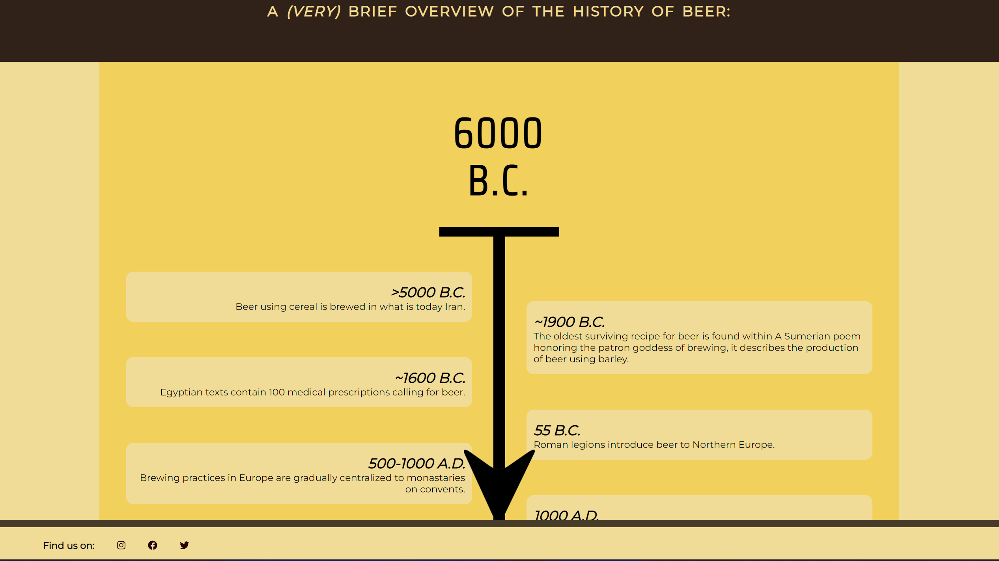
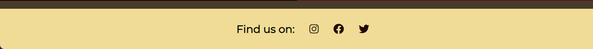
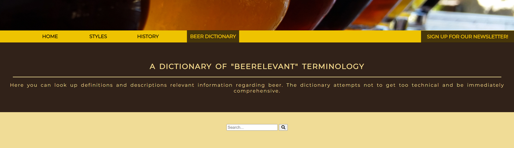
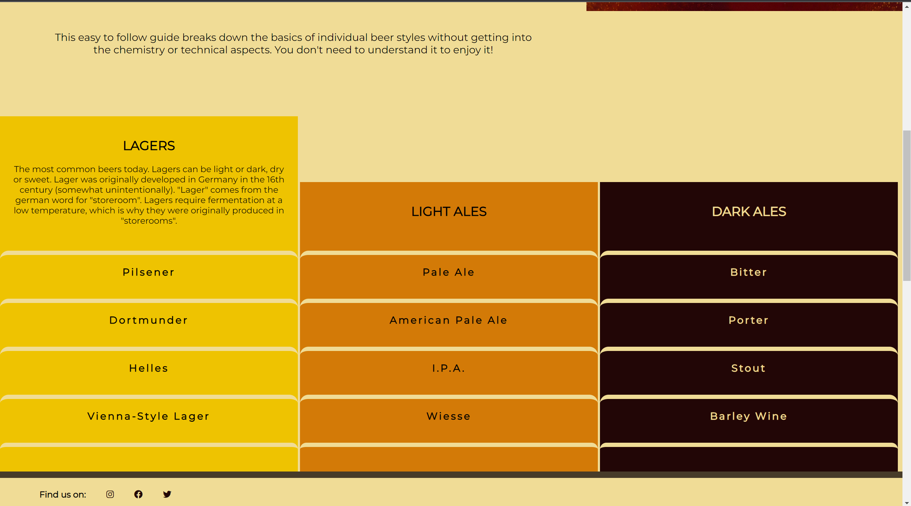

# Beer Styles
# https://fabianlien.github.io/p1-beer-styles/
The world of beer today is big and often intimidating. This style guide aims to help people gain some basic knowledge about both fundamental and trendy beer styles. There are already plenty of style guides targeting home-brewers and craft beer enthusiasts, the target users for this website are primarily those who want a quick and easy way to learn the basics of beer in order to gain some confidence when ordering that Imperial New England Style IPA or Irish Dry Stout. 

The information displayed strives to have intuitive navigation and be easily digestible through layout and style. The idea is that users will be able to return to the site and quickly find information about specific beer styles that they might be curious about. The ultimate goal of the website is to further an inclusive and welcoming culture so that more people get a chance to discover the wonderful diversity of beer.

## Existing Features
- **Hero Image and logo** - All 3 pages include a responsive Hero image containing:
  - A responsive text logotype for "BeerStyles" with a dark opaque background to increase visible accessability.
  - The responsive slogan "*Life's short, drink beer discerningly!*" also with a dark opaque background.
  - Note that the text elements are placed relative to the content of the image in order to ensure good visibile accessability.
- **Navigation Bar** - All pages also include a responsive navigation bar containing:
  - 3 links with a "*:hover*"-psuedo class linking to the 3 pages "*index.html*", "*history.html*" and "*dictionary.html*", respectively. They also show which page is active using css.
  - A drop-down-style menu (no JS used!) with content anchored to the different categories of beer styles in index.html. This feature was implemented to save scrolling time (especially for smaller screen sizes), and works from any site page.
  - A responsive anchor which opens a pop-up window to a sign-up form. The clickable area covers the text content and moves ontop of the navbar for screens with small width.

  

- **Introduction section:** 
  - This section gives the user an overview of the websites purpose and target audience using a heading and 2 short paragraphs of text. the text is interactive utilizing a accordian/zoom feauture depending on screen width. 
  - The section also includes an embedded video displaying the forming of bear foam. Its set to play once and audio is muted.This video aims to have an enticing effect on the user to trigger their curiousity about beer. It is placed either behind the text elements (small screens) or floats to the right (large screens).

  

- **Signup form** - This feature contains a responsive form that appears as a pop-up window floating infront of the rest of the page content in a fixed position with an opaque background. The form allows the user to sign up to recieve news letters via email and contains several required text fields. It has a clickable "*X*"-button to close the pop-up. It also contains a checkbox field where the user can indicate what beer-styles are to be prioritized by the back-end. 

- **Styles section** - This is the main feature that the user will use and has content relevant to the primary purpose of the website. The section contains 4 columns which have been color coded for ease of use. The columns contain pertinent, concise information about individual beer styles. In order to recuce visual stress and clutter, each "*style box*" only displays the name of the beer style until it is hovered above (tapped on touch-screens), at which point an accordian-style effect reveals relevant text content and an image depecting the preffered glass type. the amount of adjacent columns displayed is responsive to the screen width.

- **History page** - This page can be accessed from the navigation bar and takes the user to a page containing a vertically oriented scrollable timeline. It contains interesting historical fact boxes about beer that aim to further the curiosity of the user without overwhelming them with detail. The content intends to serve as "conversation grease" in everyday life and bar culture. The timeline has an added visual element, in form of an arrow (for larger screens), which aims to make the page feel more interactive. The arrow disappears when scrolling through the top of the page (a visual trick which is once again achieved without JS).

- **Footer** - The responsive footer contains icons that link to external social media pages. THe footer is fixed to the bottom of the screen on larger displays. This is avoided on smaller screens to reduce clutter and improve the effective viewport height.

## Features Not Yet Implemented

- **Dictionary** - The "*Beer Dictionary*" page will allow the user to type in text into an embedded search bar which will link to a definition heading on the same page (similar to the browsers "*Ctrl + F*") funtion). As this requires a lot of manual typing and gathering text sources the limited timeframe for this project does not currently allow for this feauture.

## Testing
Fixed issues:  
There was a visual problem with the columns in the style section. When a box in a column was highlighted the other columns would shift vertically. See screenshot:  
  
My assumption was that this was caused by a float/clear issue cuasing positions to overlap somehow. I fixed this by replacing the float property with a display:flex property and centering the content.  

## Deployment

## Credits

### Media
No attribution reuired, Free to use:  
Hero Image: https://pixabay.com/photos/beer-beer-glass-alcohol-glass-4926861/?download  
Embedded video: https://assets.mixkit.co/videos/preview/mixkit-beer-foam-forming-in-a-glass-seen-from-close-up-8708-large.mp4  
  
No attribution reuired, Non-commercial use:  
https://www.hiclipart.com/free-transparent-background-png-clipart-bjaox  
  
Attribution required:  
https://www.freepik.com/vectors/border">Border vector created by upklyak - www.freepik.com  

### Text Content
https://www.anchorbrewing.com/blog/a-history-of-lager/  
https://www.brewersassociation.org/edu/brewers-association-beer-style-guidelines/#4  
https://beerhistory.com/library/holdings/raley_timetable.shtml  
https://beerandbrewing.com/dictionary/UqfrcsPoAI/  

### Tutorials and troubleshooting
https://www.w3schools.com/  
https://stackoverflow.com/  
https://www.javatpoint.com/  

This site was built using [GitHub Pages](https://pages.github.com/).