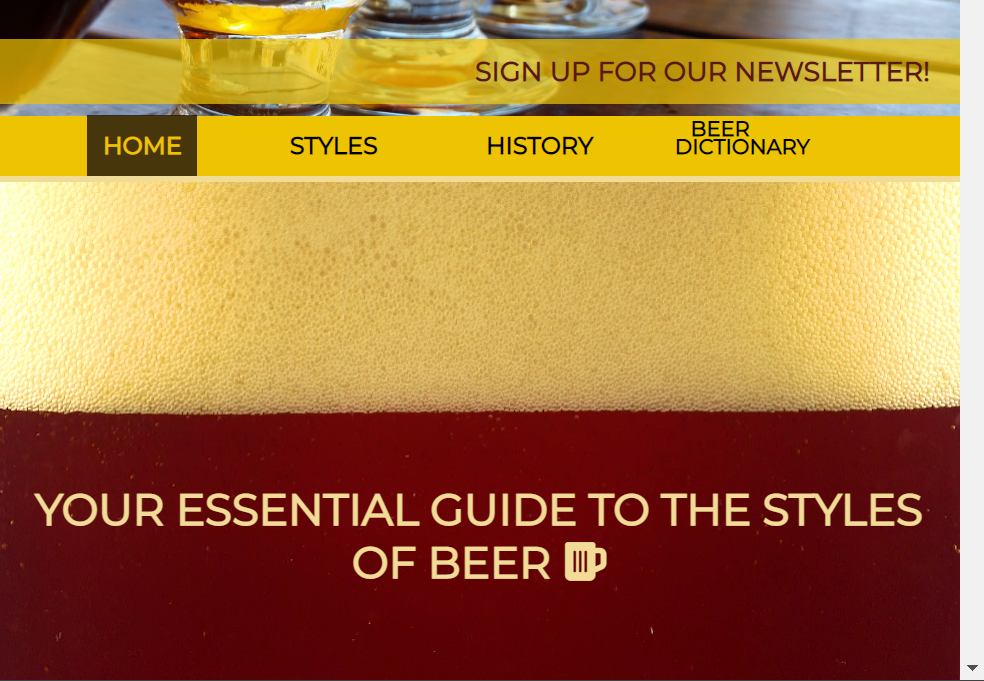
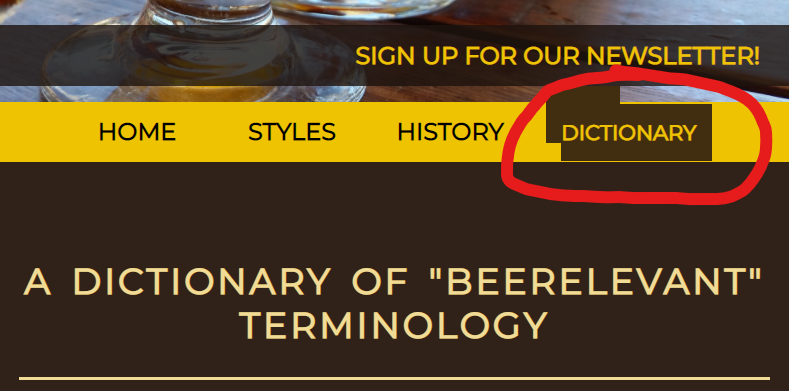

# Beer Styles
# https://fabianlien.github.io/p1-beer-styles/
The world of beer today is big and often intimidating. This style guide aims to help people gain some basic knowledge about both fundamental and trendy beer styles. There are already plenty of style guides targeting home-brewers and craft beer enthusiasts, the target users for this website are primarily those who want a quick and easy way to learn the basics of beer in order to gain some confidence when ordering that Imperial New England Style IPA or Irish Dry Stout. 

The information displayed strives to have intuitive navigation and easily digestible content through layout and style. The idea is that users will be able to return to the site and quickly find information about specific beer styles that they might be curious about. The ultimate goal of the website is to further an inclusive and welcoming culture so that more people get a chance to discover the wonderful diversity of beer.

## Existing Features
- **Hero Image and logo** - The Hero Image depicts a long row of beer glasses with differnt colors which looks very appealing. All 3 pages include a responsive Hero image containing:
  - A responsive text logotype for "BeerStyles" with a dark opaque background to increase visible accessability.
  - The responsive slogan "*Life's short, drink beer discerningly!*" also with a dark opaque background.
  - Note that the text elements are placed relative to the content of the image in order to ensure good visibile accessability.
- **Navigation Bar** - All pages also include a responsive navigation bar containing:
  - 3 links with a "*:hover*"-psuedo class linking to the 3 pages "*index.html*", "*history.html*" and "*dictionary.html*", respectively. They also show which page is active using css.
  - A drop-down-style menu (no JS used!) with content anchored to the different categories of beer styles in index.html. This feature was implemented to save scrolling time (especially for smaller screen sizes), and works from any site page.
  - A responsive anchor which opens a pop-up window to a sign-up form. The clickable area covers the text content and moves ontop of the navbar for screens with small width.

  

- **Introduction section:** 
  - This section gives the user an overview of the websites purpose and target audience using a heading and 2 short paragraphs of text. the text is interactive utilizing a accordian/zoom feauture depending on screen width. 
  - The section also includes an embedded video displaying the forming of bear foam. Its set to play once and audio is muted.This video aims to have an enticing effect on the user to trigger their curiousity about beer. It is placed either behind the text elements (small screens) or floats to the right (large screens).

  

- **Signup form** - This feature contains a responsive form that appears as a pop-up window floating infront of the rest of the page content in a fixed position with an opaque background. The form allows the user to sign up to recieve news letters via email and contains several required text fields. It has a clickable "*X*"-button to close the pop-up. It also contains a checkbox field where the user can indicate what beer-styles are to be prioritized by the back-end. 

- **Styles section** - This is the main feature that the user will use and has content relevant to the primary purpose of the website. The section contains 4 columns which have been color coded for ease of use. The columns contain pertinent, concise information about individual beer styles. In order to recuce visual stress and clutter, each "*style box*" only displays the name of the beer style until it is hovered above (tapped on touch-screens), at which point an accordian-style effect reveals relevant text content and an image depecting the preffered glass type. the amount of adjacent columns displayed is responsive to the screen width.

- **History page** - This page can be accessed from the navigation bar and takes the user to a page containing a vertically oriented scrollable timeline. It contains interesting historical fact boxes about beer that aim to further the curiosity of the user without overwhelming them with detail. The content intends to serve as "conversation grease" in everyday life and bar culture. The timeline has an added visual element, in form of an arrow (for larger screens), which aims to make the page feel more interactive. The arrow disappears when scrolling through the top of the page (a visual trick which is once again achieved without JS).

- **Footer** - The responsive footer contains icons that will allow the user to access links to external social media pages tied to the website. The footer is fixed to the bottom of the screen on larger displays. This is avoided on smaller screens to reduce clutter and improve the effective viewport height.

## Features Not Yet Implemented/Unfinished features

- **Dictionary** - The "*Beer Dictionary*" page will allow the user to type in text into an embedded search bar which will link to a definition heading on the same page (similar to the browsers "*Ctrl + F*") funtion). As this requires a lot of manual typing and gathering text sources the limited timeframe for this project does not currently allow for this feauture.

- **Beer style boxes** - Many of the boxes have missing content and some headings are are still only placeholder. This content will be added/updated in the future.

- **Advertisement iframes** - A possible future feature (if the webiste purpose is adapted for commercial enterprise) would be to add advertisement iframes on the different pages. For example one such feature could be implemented here:
 

## Testing

### Validators:
**HTML:**  
No errors were returned when passing through the official W3C validator.  
**CSS:**  
No errors were found when passing through the official (Jigsaw) validator.

### Fixed bugs/issues:  
- <ins>Bug:</ins> There was a visual problem with the columns in the style section. When a box in a column was highlighted the other columns would shift vertically. See screenshot:  
  
<ins>Fix:</ins> My assumption was that this was caused by a float/clear issue cuasing positions to overlap somehow. I fixed this by replacing the float property with a display:flex property and centering the content.

- <ins>Bug:</ins> The container of the anchor element for the signup form would shift to the right when hovered over, causing the container to extend past the viewport width and thus a x-scrollbar to appear at the bottom of the window (see screenshot below).  

<ins>Fix:</ins> I removed the css psuedo class which caused all nav anchor elements to get additional padding when hovered above, and instead added "invisible" padding to the same elements as default. Once the "shift right" effect was removed I decided the "*signup*" ID needed some other "*:hover*" psuedoclass styling. so I increased the font size and inverted text and background color (see screenshot below).

- <ins>Bug:</ins> The signup form popup, as it has a position value of "*fixed*" does change it's relative position when scrolling. This looks very good in full-screen mode, but in a windowed browser with a low height the bottom of the form would be croped and the information in it unaccessible until the window height is adjusted. See screenshot:

<ins>Fix:</ins> This problem will not be resolved visually by adjusting the responsiveness to the window height as this would require overhauling the form content layout and would end up looking unappealing/cramped together. Therefore the solution was to add a overflow attribute with a scroll value to the parent container of the form.

- <ins>Bug:</ins> At the bottom of the "*Beer Styles*" section there would be a a large empty space generated below adjacent columns when hovering above one of the columns. This occured because the wrapper for the "*style columns*" was set to fit content. See screenshot:

- <ins>Fix:</ins> A simple solution would have been to give it a fixed height, but that would again be visually unappealing and look quite underwhelming. Instead the solution became a visual overhaul:
  - I created a threshold below each column.
  - I styled the threshold to be transparent and roughly the same height as the expanded "*style box*" above it.
  - I targeted it with a psuedo class causing it to not display when hovered above the "*style box*".
  - I added a nice background and made it responsive.  

  The final result ended up looking like this:
  

- <ins>Bug:</ins> A small visual issue was caused by the padding for "*beer dictionary*" link when active in the nav bar for smaller media queries. See screenshot:

<ins>Fix:</ins> The solution was to remove the excess padding, setting the left margin to a 0 value, and then using a "*bottom-border*" with the same color property as the padding.

### Unfixed bugs:
- <ins>Bug:</ins> On the history.html page, when the "*styles*" button element is hovered above, a psuedo class triggers an element to display. This element contains the links to the "*style columns*" and is supposed to display ontop of other page elements as it has a z-index value of 3. However, the "*z2-wrapper*" class element which occupies the same space, remains on top. Even though it has a z-index value of 2.  
<ins>Troubleshooting:</ins> I have attempted to make adjustments to the position value of both elements with no success. Altering the specificity had no distinguishable effect. I have also tried adding wrappers with an absolute position value and different "z-index" values around each element. Finally i tried adding another *class:hover* to the button element that would change the "z-index" value of the "*z2-wrapper*" class, but again to no effect.

## Deployment
Initial deployment occured on 19/02/2202 via [GitHub Pages](https://pages.github.com/).  
An active link to the deployed website can be found at the top of this document. Otherwise, click [here](https://fabianlien.github.io/p1-beer-styles/).

### Deployment via GitHub Pages
The project was deployed to GitHub Pages using the following steps...
1. Log in to GitHub and locate the GitHub Repository
2. At the top of the Repository (not top of page), locate the "Settings" Button on the menu.
3. Select "Pages" from the menu on the left hand side..
4. Under "Source", click the dropdown called "None" and select "Master Branch".
The page will automatically refresh.
5. The published link will appear shortly in a green box at the top of the page.

### Forking the GitHub Repository
By forking the GitHub Repository we make a copy of the original repository on our GitHub account to view and/or make changes without affecting the original repository by using the following steps...

1. Log in to GitHub and locate the GitHub Repository
2. At the top of the Repository (not top of page) just above the "Settings" Button on the menu, locate the "Fork" Button.
3. You should now have a copy of the original repository in your GitHub account.

### Making a Local Clone
1. Log in to GitHub and locate the GitHub Repository
2. Under the repository name, click "Clone or download".
3. To clone the repository using HTTPS, under "Clone with HTTPS", copy the link.
4. Open Git Bash
5. Change the current working directory to the location where you want the cloned directory to be made.
6. Type "*git clone*", and then paste the URL you copied in Step 3.
`$ git clone https://fabianlien.github.io/p1-beer-styles/`

7. Press Enter. Your local clone will be created.  
`$ git clone https://fabianlien.github.io/p1-beer-styles/`  
`> Cloning into CI-Clone>...`  
`> remote: Counting objects: 10, done.`  
`> remote: Compressing objects: 100% (8/8), done.`  
`> remove: Total 10 (delta 1), reused 10 (delta 1)`  
`> Unpacking objects: 100% (10/10), done.`  

## Credits

### Media
No attribution reuired - Free to use:  
[Fonts by Google](https://fonts.googleapis.com/css2?family=Montserrat&family=Orbitron&family=Saira+Condensed:wght@300&display=swap)  
[HTML-Embedded Icons from Font Awesome](https://fontawesome.com/)  
[Hero Image](https://pixabay.com/photos/beer-beer-glass-alcohol-glass-4926861/?download)  
[Embedded video](https://assets.mixkit.co/videos/preview/mixkit-beer-foam-forming-in-a-glass-seen-from-close-up-8708-large.mp4)
  
No attribution reuired - Non-commercial use only:  
[Timeline Arrowhead](https://www.hiclipart.com/free-transparent-background-png-clipart-bjaox)
  
No attribution reuired - Purchased commercial license:  
[Beer glass set by LAFS](PNGhttps://creativemarket.com/Olga.Prikhodko/3896021-Beer-glasses-%28outline-colored-icons%29)
[Barley and hops backround](https://depositphotos.com/125214710/stock-photo-malt-and-hops.html)

### Text Content
https://www.anchorbrewing.com/blog/a-history-of-lager/  
https://www.brewersassociation.org/edu/brewers-association-beer-style-guidelines/#4  
https://beerhistory.com/library/holdings/raley_timetable.shtml  
https://beerandbrewing.com/dictionary/UqfrcsPoAI/  

### Tutorials and troubleshooting
https://www.w3schools.com/  
https://stackoverflow.com/  
https://www.javatpoint.com/  
https://www.markdownguide.org/basic-syntax/  

### This site was built using [GitHub Pages](https://pages.github.com/).